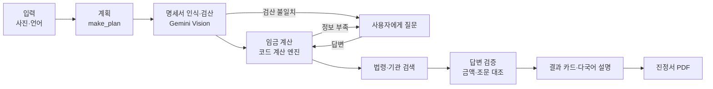

# 🛡️ 임금 지킴이 (Wage Guardian)

**급여명세서 사진 한 장으로 임금체불을 찾아내고, 진정서 초안까지 만들어 주는 외국인 근로자용 다국어 AI Agent**

2026 제4회 경남 AI·SW 경진대회 · 대학부 · 주제 01 사회문제 해결형 AI Agent

- 🌐 **바로 체험:** https://wage-guardian-gn.streamlit.app
  (왼쪽 사이드바 **T10 · 복합 위반** → **분석 시작**. AI 사용량이 부족하면 **데모 모드**를 켜세요.)

---

## 왜 만들었나

경남(거제·통영 조선, 김해·창원 제조, 밀양·남해 농어업)의 외국인 근로자는 한국어 급여명세서를 읽기 어려워 최저임금·주휴수당·가산수당·숙식비 공제가 맞는지 스스로 확인하기 어렵습니다. 임금 지킴이는 사진 한 장으로 받지 못한 금액을 찾고, 모국어로 설명하고, 진정서 초안과 관할 노동청까지 안내합니다.

## 동작 흐름



**핵심 원칙: 계산은 코드, 판단과 설명은 AI.** 금액은 `wage_calc.py`만 계산하므로 AI가 매번 다르게 말해도 결과 금액은 항상 같습니다.

## AI Agent 6요소

| 요소 | 구현 |
|---|---|
| Goal | 받아야 할 임금 확인 → 못 받았으면 구제 안내 |
| Planning | `make_plan`으로 실행 계획 수립 |
| Reasoning | 5인 미만이면 가산수당 검사 생략, 위반 없으면 진정 단계 생략, 도구마다 호출 이유 기록 |
| Tool Use | 명세서 인식, 임금 계산, 법령 검색, 상담기관 검색, 진정서 PDF |
| Memory/State | 추출값·답변·추정값·계산 결과·검색 조문을 세션에 보관 |
| Feedback | 합계 검산, 필수값 없으면 계산 보류 후 질문, 답변 검증, 사용량 초과 시 재시도·모델 전환 |

## 할루시네이션 방지 4단계

1. **인식 검산** — 지급 항목 합계 = 지급총액, 지급총액 − 공제총액 = 실수령액
2. **입력 검증** — 사업장 규모·근로시간·숙식비 동의가 없으면 계산 거부 → 질문
3. **계산은 코드** — 결과 카드는 계산 엔진 값을 그대로 표시
4. **답변 검증** — 계산 결과에 없는 금액, 검색되지 않은 조문이 있으면 그 줄 삭제

## 파일 구성

| 파일 | 역할 |
|---|---|
| `app.py` | Streamlit 웹 화면, Agent 실행 타임라인 |
| `agent.py` | Gemini 함수 호출 기반 Agent 루프, 도구 6개, 답변 검증 |
| `wage_calc.py`, `rules_2026.json` | 임금 계산 엔진, 2026년 규칙 값 |
| `extractor.py` | 명세서 인식(Gemini Vision) + 합계 검산 |
| `llm.py` | Gemini 연결, 사용량 초과 시 대기·재시도·모델 전환 |
| `laws.py` | 법령 조문 요지 검색, 경남 관할 노동청 안내 |
| `complaint_pdf.py` | 진정서 초안 PDF |
| `demo.py`, `validators.py` | 데모 모드 (AI 호출 불가 시 대체 경로) |
| `make_samples.py`, `samples/` | 테스트용 가상 급여명세서 |
| `cases.json`, `test_wage_calc.py` | 테스트 케이스 9건, 자동 테스트 |

## 로컬 실행

```bash
pip install -r requirements.txt
# .streamlit/secrets.toml 파일을 만들고 아래 내용 입력
#   GEMINI_API_KEY = "본인 키"
#   GEMINI_MODEL = "gemini-2.5-flash"
streamlit run app.py
```

## 테스트

```bash
pytest -v        # 계산 엔진 9건
python agent.py samples/T10.png   # 터미널에서 Agent 전체 흐름
```

| ID | 시나리오 | 결과 |
|---|---|---|
| T01 | 정상 지급 | 0원 |
| T03 | 연장 20시간 미지급 (5인 이상) | 309,600원 |
| T04 | 같은 조건, 5인 미만 | 206,400원 (가산 미적용) |
| T07 | 숙식비 과다 공제 | 319,606원 |
| T10 | 복합 위반 5건 (실제 Gemini) | 999,823원 |
| G01 | 지급총액 불일치 명세서 | 검산이 감지 |

## 사용 기술과 출처

Python · Streamlit · Google Gemini API (Function Calling, Vision) · reportlab · pandas · Pillow · pytest · 나눔고딕(SIL OFL)
법령: 국가법령정보센터 근로기준법·최저임금법 / 기준: 고용노동부 2026년 최저임금 고시(시간급 10,320원)
코드 작성에 AI 코딩 도구(Claude)를 활용했으며, 상세 내역은 출처·AI 활용 신고서에 기재했습니다.

## 고지

- 이 서비스의 결과는 **참고용**이며 법률 자문이 아닙니다. 최종 판단은 고용노동부 또는 공인노무사에게 확인하세요.
- 업로드한 사진은 서버에 저장하지 않습니다. 저장소의 명세서는 모두 **가상 인물·가상 사업장**입니다.
